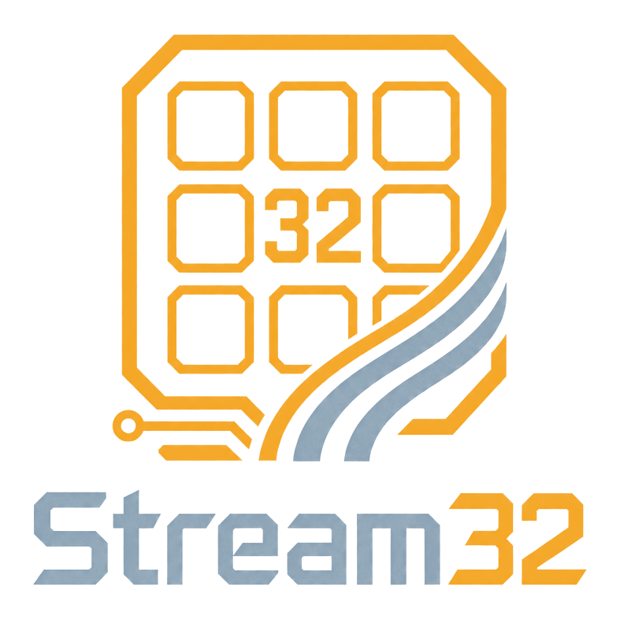

<div align="center">
  

  <h1>Stream32</h1>

  <p>An open-source stream deck powered by ESP32.</p>

  <a href="./LICENSE">
    
  </a>
</div>

## Why Stream32?

Stream32 is a DIY stream deck built around the accessible and versatile ESP32 platform. The goal is a device you can build, understand, repair, and adapt to your own workflow—without proprietary hardware or software lock-in.

Everything needed to reproduce and modify the project will live here in the open.

## Project status

> [!NOTE]
> Stream32 is in its earliest stage. Initial firmware supports the Waveshare
> ESP32-S3-Touch-LCD-4 hardware Rev 3.0; custom hardware designs have not been
> published yet.

The project is currently taking shape. Planned areas include:

- **Firmware** — the first display/touch self-test and USB protocol live under
  [`boards/`](./boards).
- **Hardware** — reproducible electronics, a bill of materials, and enclosure designs.
- **Host tools** — configuration and integrations for desktop workflows.
- **Documentation** — clear instructions to build, flash, configure, and customize your own Stream32.

Plans may change as the first prototype is developed and tested.

## Desktop app

The Electron companion lives in [`desktop/`](./desktop). It runs in the system
tray, can launch quietly at login, checks GitHub Releases for updates, and can
download and flash supported board firmware over USB.

Node.js 22 or newer is required for local development:

```sh
cd desktop
npm install
npm start
```

Run `npm test` and `npm run check` before opening a pull request. Pull requests
that touch the desktop app are packaged on Windows, macOS, and Linux. To build
an installer for your current platform locally, run `npm run dist`.

### Board firmware and flashing

The desktop app loads board support independently from the rolling
`boards-current` GitHub Release. It downloads only the selected firmware,
checks its declared size and SHA-256 hash, and caches it for offline
reflashing. Adding a compatible profile therefore does not require a desktop
release.

The current profile is specifically for the 4-inch, 480×480 Waveshare
`ESP32-S3-Touch-LCD-4` with a **Rev 3.0** silkscreen. Rev 4 and the 4.3-inch
product are not interchangeable. See [`boards/README.md`](./boards/README.md)
for firmware builds, profile publishing, the USB protocol, and BOOT-mode
recovery.

### Publishing a desktop release

The package version and Git tag must match. For example:

```sh
cd desktop
npm version 0.2.0 --no-git-tag-version
cd ..
git add desktop/package.json desktop/package-lock.json
git commit -m "chore(desktop): prepare v0.2.0"
git tag v0.2.0
git push origin main v0.2.0
```

The `v*` tag starts the release workflow. It creates a GitHub Release containing
an NSIS installer and portable executable for Windows, DMG and ZIP packages for
macOS, and AppImage and Debian packages for Linux.

Packaged apps check for updates shortly after launch; updates can also be
checked from the tray menu. macOS automatic installation requires a signed
build, so the unsigned CI artifacts must be signed and notarized before macOS
auto-update can complete.

## Contributing

Ideas, hardware suggestions, and early contributions are welcome. Start a conversation by [opening an issue](https://github.com/FadyFaheem/Stream32/issues).

## License

Stream32 is released under the [MIT License](./LICENSE).
