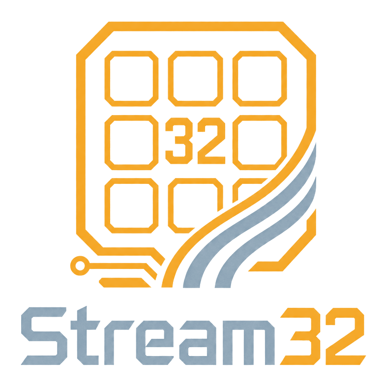
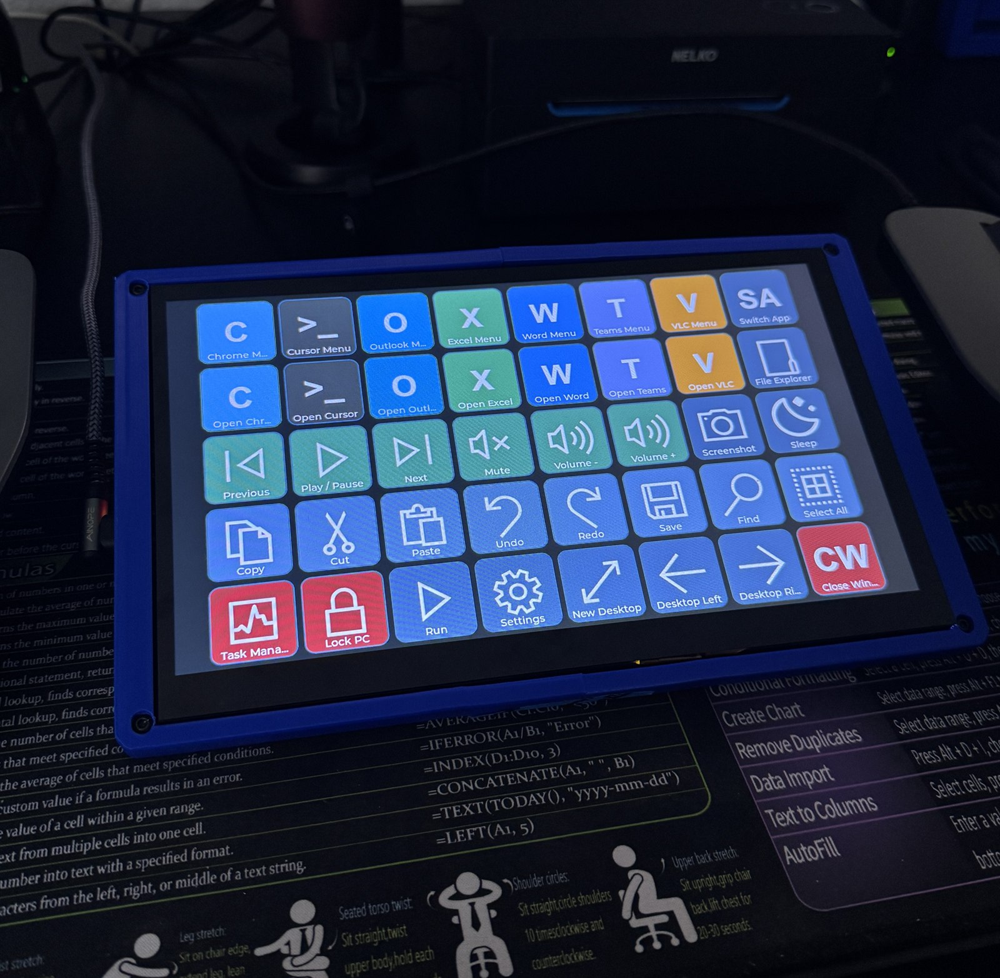

<div align="center">
  

  <h1>Stream32</h1>

  <p>An open-source stream deck powered by ESP32.</p>

  <a href="./LICENSE">
    
  </a>

  <br>
  <br>

  
</div>

## Why Stream32?

Stream32 is a DIY stream deck built around the accessible and versatile ESP32
platform. The goal is a device you can build, understand, repair, and adapt to
your own workflow, without proprietary hardware or software lock-in.

You buy an off-the-shelf touch display, flash it from the desktop app, and lay
out pages of keys that launch apps, press hotkeys, run multi-step actions, and
more. Everything needed to reproduce and modify the project lives here in the
open.

## Project status

> [!NOTE]
> Stream32 is usable today. The desktop app ships installers for Windows,
> macOS, and Linux, and supports two off-the-shelf touch displays. Custom
> open-hardware designs (schematics, BOM, and enclosures) are still on the
> roadmap.

## Getting started

1. **Pick a supported display.** See [Buying a display](./boards/BUYING.md).
2. **Install the desktop app.** Download the latest build for your operating
   system from the
   [releases page](https://github.com/FadyFaheem/Stream32/releases/latest).
3. **Flash the firmware.** Connect the board over USB and let the app download
   and flash the matching firmware.
4. **Build your deck.** Add pages and keys, then assign actions.

The [Getting started guide](./docs/GETTING_STARTED.md) walks through each step,
including the USB and power requirements for each board.

## Supported hardware

| Display | Screen | Deck size | Notes |
| --- | --- | --- | --- |
| Waveshare `ESP32-S3-Touch-LCD-4` | 480x480, 4" | up to 5x5, 8 pages | **Rev 3.0 only** (not Rev 4 or the 4.3" board) |
| Elecrow `CrowPanel Advanced 10.1"` ESP32-P4 | 1024x600, 10.1" | up to 40 keys/page, 8 pages | UART0 carries power, data, and flashing; USB 2.0 adds power and a much faster sync link |

Purchase links and buying tips are in [Buying a display](./boards/BUYING.md).
Firmware, flashing, and the USB protocol are documented in
[`boards/README.md`](./boards/README.md).

## Documentation

| Guide | For | What it covers |
| --- | --- | --- |
| [Getting started](./docs/GETTING_STARTED.md) | Users | Install, flash, and set up your first deck |
| [Buying a display](./boards/BUYING.md) | Users | Which board to buy and what to avoid |
| [Waveshare Rev 3 power-button bypass](./docs/WAVESHARE_V3_POWER_BUTTON_BYPASS.md) | Waveshare owners | Optional automatic power-on hardware modification |
| [Decks and profiles](./desktop/DECKS.md) | Users | Profiles, focused-app switching, editing, Multi Actions |
| [Action plugins](./desktop/PLUGINS.md) | Users and authors | Installing, publishing, and writing action plugins |
| [Companion surfaces](./desktop/COMPANION.md) | Users | Driving a deck from Bitfocus Companion over the Satellite API |
| [Board support](./boards/README.md) | Contributors | Firmware builds, flashing behavior, and the USB protocol |

## Development

The Electron companion lives in [`desktop/`](./desktop). Node.js 22 or newer is
required:

```sh
cd desktop
npm ci
npm start
```

Run `npm test` and `npm run check` before opening a pull request. Pull requests
that touch the desktop app are packaged on Windows, macOS, and Linux. To build
an installer for your current platform locally, run `npm run dist`.

Board profiles and firmware are versioned independently of the desktop app, so
adding a compatible board does not require a desktop release. See
[`boards/README.md`](./boards/README.md) for the board workflow.

### Publishing a desktop release

The package version and Git tag must match. For example:

```sh
cd desktop
npm ci
npm test
npm run check
npm version 1.1.0 --no-git-tag-version
cd ..
git add desktop/package.json desktop/package-lock.json
git commit -m "chore(desktop): prepare v1.1.0"
git tag v1.1.0
git push origin main v1.1.0
```

The `v*` tag starts the release workflow, which packages Windows, macOS, and
Linux builds and publishes a GitHub Release. macOS automatic installation
requires a signed build, so the unsigned CI artifacts must be signed and
notarized before macOS auto-update can complete.

### Update channels

Settings offers a **Stable** and a **Nightly** channel. Nightly builds are
published from `main` by the `Nightly Desktop` workflow when it has new commits
to package, as prereleases tagged `v<next patch>-nightly.<date>.<run>`. Only the
three most recent nightlies are kept. Stable installs never see them, because
electron-updater resolves the stable channel through the latest non-prerelease
GitHub Release.

Turning on **Developer mode** adds a channel for every pull request labelled
`preview`. Labelling one publishes installable builds of its head commit as
`v<next patch>-pr<number>.<run>` prereleases, and closing the pull request or
removing the label deletes them. Because those builds are published as
releases, only pull requests from branches in this repository can produce them.

Switching channels installs whichever build that channel offers, including an
older one when moving back to Stable. The channel a build belongs to is the
SemVer prerelease identifier of its tag, so keep the tag, the version in
`desktop/package.json`, and the published `latest.yml` in agreement.

## Contributing

Ideas, hardware suggestions, and early contributions are welcome. Start a
conversation by
[opening an issue](https://github.com/FadyFaheem/Stream32/issues).

## License

Stream32 is released under the [MIT License](./LICENSE).
